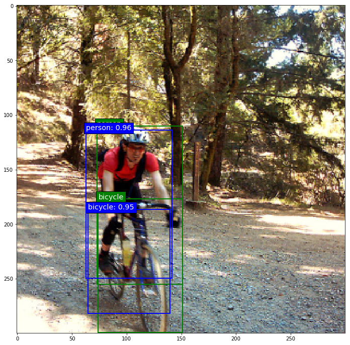
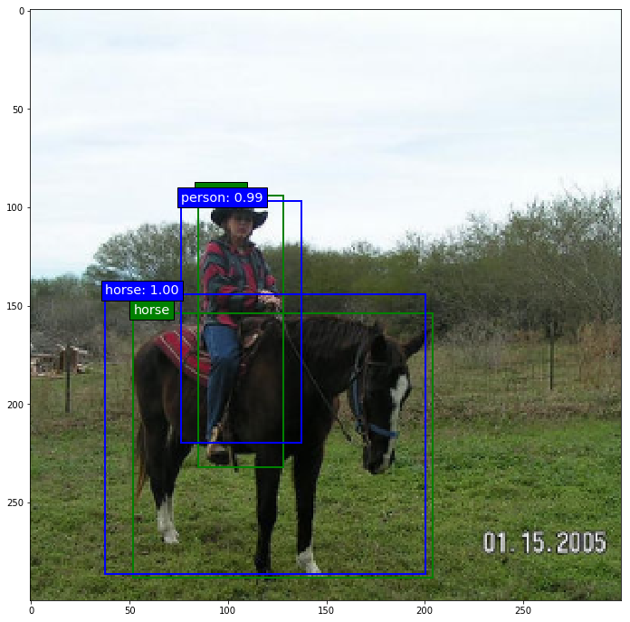
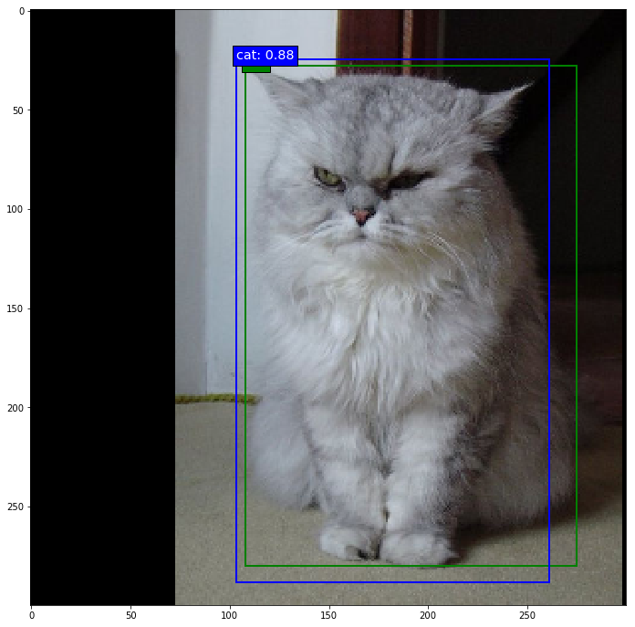
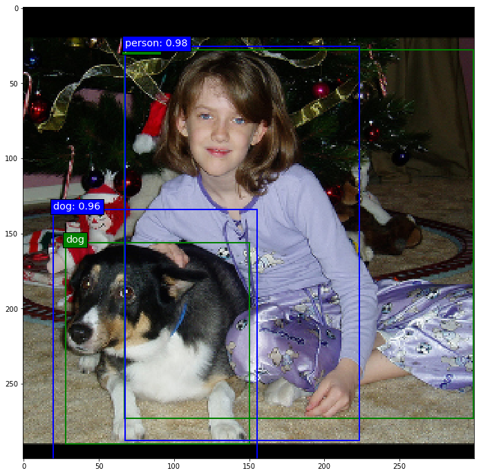

## SSD: Single-Shot MultiBox Detector implementation in Keras
---
### Contents

1. [Overview](#overview)
2. [Evaluation results](#evaluation-results)
3. [Examples](#examples)
4. [Dependencies](#dependencies)
5. [How to use it](#how-to-use-it)
6. [Download the convolutionalized VGG-16 weights](#download-the-convolutionalized-vgg-16-weights)
7. [Download the original trained model weights](#download-the-original-trained-model-weights)
8. [ToDo](#todo)
9. [Important notes](#important-notes)
10. [Terminology](#terminology)

### Overview

This is a Keras implementation of the SSD model architecture introduced by Wei Liu et al. in the paper [SSD: Single Shot MultiBox Detector](https://arxiv.org/abs/1512.02325).

The main goal of this project is to create an SSD implementation that is well documented for those who are interested in a low-level understanding of the model. The documentation and detailed comments hopefully make it a bit easier to dig into the code and adapt or build upon the model than with most other implementations out there (Keras or otherwise) that provide little to no documentation and comments.

Ports of the trained weights of all the original models are provided below, as are convolutionalized VGG-16 weights in case you would like to train from scratch.

There are currently the following network architectures in this repository:
* SSD300: [`keras_ssd300.py`](./keras_ssd300.py)
* SSD512: [`keras_ssd512.py`](./keras_ssd512.py)
* SSD7: [`keras_ssd7.py`](./keras_ssd7.py) - a smaller 7-layer version that can be trained from scratch relatively quickly even on a mid-tier GPU, yet is capable enough for less complex object detection tasks and testing. You're obviously not going to get state-of-the-art results with that one.

If you want to build an arbitrary SSD model architecture, you can use [`keras_ssd7.py`](./keras_ssd7.py) as a template. It provides documentation and comments to help you adapt it for an arbitrary base network.

### Evaluation results

Below you find the mAP values measured using the official Pascal VOC Matlab evaluation script. In all cases the results are either identical to those of the original Caffe models or surpass them slightly.

<table width="70%">
  <tr>
    <td>evaluated on</td>
    <td colspan=2 align=center>VOC2007 test</td>
  </tr>
  <tr>
    <td>trained on<br>IoU rule</td>
    <td align=center width="35%">07+12<br>0.5</td>
    <td align=center width="35%">07+12+COCO<br>0.5</td>
  </tr>
  <tr>
    <td><b>SSD300</td>
    <td align=center><b>77.6</td>
    <td align=center><b>81.2</td>
  </tr>
  <tr>
    <td><b>SSD512</td>
    <td align=center><b>79.8</td>
    <td align=center><b>83.2</td>
  </tr>
</table>

### Examples

Below are some prediction examples of the fully trained original SSD300 "07+12" model (i.e. trained on Pascal VOC2007 `trainval` and VOC2012 `trainval`). The predictions were made on Pascal VOC2007 `test`.

| | |
|---|---|
|  |  |
|  |  |

Next, some prediction examples of an SSD300 partially trained (20,000 steps at batch size 32) on Pascal VOC2007 `trainval`, VOC2007 `test`, and VOC2012 `train`. The predictions were made on VOC2012 `val`. The box coordinates are still a bit off, but you can see that the model has already learned quite a bit. Predictions are in blue, ground truth in green.

| | |
|---|---|
|  |  |
|  |  |

Finally, some prediction examples of an SSD7 (i.e. the small 7-layer version) partially trained on two street traffic datasets released by [Udacity](https://github.com/udacity/self-driving-car/tree/master/annotations) with roughly 20,000 images in total and 5 object categories (more info in [`ssd7_training.ipynb`](./ssd7_training.ipynb). The predictions you see below were made after 10,000 training steps at batch size 32. Admittedly, cars are comparatively easy objects to detect and I picked a few of the better examples, but it is nonetheless remarkable what such a small model can do after only 10,000 training iterations.

| | |
|---|---|
|  |  |
|  |  |

### Dependencies

* Python 3.x
* Numpy
* TensorFlow 1.x
* Keras 2.x
* OpenCV (for data augmentation)
* Beautiful Soup 4.x (to parse XML files)

The Theano and CNTK backends are currently not supported.

### How to use it

This repository provides Jupyter notebooks that explain training, inference and evaluation, and there are a bunch of explanations in the subsequent sections that complement the notebooks.

How to use a trained model for inference:
* [`ssd300_inference.ipynb`](./ssd300_inference.ipynb)
* [`ssd512_inference.ipynb`](./ssd512_inference.ipynb)

How to train a model:
* [`ssd300_training.ipynb`](./ssd300_training.ipynb)
* [`ssd7_training.ipynb`](./ssd7_training.ipynb)

How to evaluate a trained model:
* On MS COCO: [`ssd300_evaluation_COCO.ipynb`](./ssd300_evaluation_COCO.ipynb)
* On Pascal VOC: [`ssd300_evaluation_Pascal_VOC.ipynb`](./ssd300_evaluation_Pascal_VOC.ipynb)

#### Training details

The general training setup is layed out and explained in [`ssd7_training.ipynb`](./ssd7_training.ipynb) and in [`ssd300_training.ipynb`](./ssd300_training.ipynb). The setup and explanations are similar in both notebooks for the most part, so it doesn't matter which one you look at to understand the general training setup, but the parameters in [`ssd300_training.ipynb`](./ssd300_training.ipynb) are preset to copy the setup of the original Caffe implementation for training on Pascal VOC, while the parameters in [`ssd7_training.ipynb`](./ssd7_training.ipynb) are preset to train on the [Udacity traffic datasets](https://github.com/udacity/self-driving-car/tree/master/annotations). If your goal isn't to train the original SSD300, then I would recommend reading [`ssd7_training.ipynb`](./ssd7_training.ipynb), which contains slightly more general explanations.

To train the original SSD300 model on Pascal VOC:

1. Download the datasets:
  ```c
  wget http://host.robots.ox.ac.uk/pascal/VOC/voc2012/VOCtrainval_11-May-2012.tar
  wget http://host.robots.ox.ac.uk/pascal/VOC/voc2007/VOCtrainval_06-Nov-2007.tar
  wget http://host.robots.ox.ac.uk/pascal/VOC/voc2007/VOCtest_06-Nov-2007.tar
  ```
2. Download the weights for the convolutionalized VGG-16 or for one of the trained original models provided below.
3. Set the file paths for the datasets and model weights accordingly in [`ssd300_training.ipynb`](./ssd300_training.ipynb) and execute the cells.

The procedure for training SSD512 is the same of course. It is strongly recommended that you load the pre-trained VGG-16 weights when attempting to train an SSD300 or SSD512, otherwise your training will almost certainly be unsuccessful. Note that the original VGG-16 was trained layer-wise, so trying to train the even deeper SSD300 all at once from scratch will very likely fail. Also note that even with the pre-trained VGG-16 weights it will take at least ~20,000 training steps to get a half-decent performance out of SSD300.

#### Working with the generator

This repository provides a data generator built specifically for 2-D bounding box object detection. If you'd like to train a model on arbitrary datasets, a brief introduction to the design of the generator might be useful.

The generator can handle the following annotation formats out of the box:
* Pascal VOC (`parse_xml()`)
* MS COCO (`parse_json()`)
* Quite a range of CSV formats (`parse_csv()`)

The generator class `BatchGenerator` is in the module [`ssd_batch_generator.py`](./ssd_batch_generator.py) and using it consists of three steps:

1. Create an instance using the constructor. The constructor mainly just sets the desired order in which the generator yields the ground truth box coordinates and class ID, but you can also pass it filename and ground truth lists as described in step 2. Even though different output coordinate orders are theoretically possible, `SSDBoxEncoder` currently requires the generator to pass ground truth box coordinates to it in the format `[class_id, xmin, ymin, xmax, ymax]`, which is also the constructor's default setting for this parameter.
2. Next, lists of image names and annotations (labels, targets, call them whatever you like) need to be parsed from one or multiple source files such as CSV or XML files by calling one of the parser methods that `BatchGenerator` provides. The generator object stores the data that is later used to generate the batches in two Python lists: `filenames` and `labels`. The former contains just the file paths of the images to be included, e.g. "some_dataset/001934375.png". The latter contains for each image a Numpy array with the bounding box coordinates and object class ID of each labeled object in the image. The job of the parse methods that the generator provides is to create these two lists. `parse_xml()` does this for the Pascal VOC data format, `parse_json()` does it for the MS COCO format, and `parse_csv()` does it for any CSV file in which the image names, class IDs and box coordinates make up the first six columns of the file. If you have a dataset that stores its annotations in a format that is not compatible with the two existing parser methods, you can just write an additional parser method that can parse whatever format your annotations are in. As long as that parser method sets the two lists `filenames` and `labels` as described in the documentation, you can use this generator with an arbitrary dataset without having to change anything else.
3. Finally, in order to actually generate a batch, call the `generate()` method. You have to set the desired batch size and whether or not to generate batches in training mode. If batches are generated in training mode, `generate()` calls the `encode_y()` method of `SSDBoxEncoder` from the module [`ssd_box_encode_decode_utils.py`](./ssd_box_encode_decode_utils.py) to convert the ground truth labels into the big tensor that the cost function needs. This is why you need to pass an `SSDBoxEncoder` instance to `generate()` in training mode. Inside `encode_y()` is where the anchor box matching and box coordinate conversion happens. If batches are not generated in training mode, then any ground truth labels that there may be are just returned in their regular format along with the images. The remaining arguments of `generate()` are mainly image manipulation features for ad-hoc data augmentation and to get the images into the size you need. The documentation describes them in detail.

#### Encoding and decoding boxes

The module [`ssd_box_encode_decode_utils.py`](./ssd_box_encode_decode_utils.py) contains all functions and classes related to encoding and decoding boxes. Encoding boxes means converting ground truth labels into the target format that the loss function needs during training. It is this encoding process in which the matching of ground truth boxes to anchor boxes (the paper calls them default boxes and in the original C++ code they are called priors - all the same thing) happens. Decoding boxes means converting raw model output back to the input label format, which entails various conversion and filtering processes such as non-maximum suppression (NMS).

In order to train the model, you need to create an instance of `SSDBoxEncoder` that needs to be passed to the batch generator. The batch generator does the rest, so you don't usually need to call any of `SSDBoxEncoder`'s methods manually. If you choose to use your own generator, here is very briefly how the `SSDBoxEncoder` class is set up: In order to produce a tensor for training you only need to call `encode_y()` (performs the matching). You won't have to call the methods `generate_anchor_boxes_for_layer()` (computes the anchor box coordinates for a given predictor layer) and `generate_encode_template()` (builds a template full of anchor boxes computed by `generate_anchor_boxes_for_layer()`).

To decode the raw model output, call either `decode_y()` or `decode_y2()`. The former follows the original implementation, which entails performing NMS per object class, while the latter performs NMS globally across all object classes and is thus slightly more efficient, but also behaves slightly differently. Read the documentation for details about both functions.

A note on the `SSDBoxEncoder` constructor: The `coords` argument lets you choose what coordinate format the model will learn. In the default 'centroids' format, the targets will be converted to the `(cx, cy, w, h)` coordinate format used in the original implementation.

A note on the anchor box offset coordinates used internally by the model: This may or may not be obvious to you, but it is important to understand that it is not possible for the model to predict absolute coordinates for the predicted bounding boxes. In order to be able to predict absolute box coordinates, the convolutional layers responsible for localization would need to produce different output values for the same object instance at different locations within the input image. This isn't possible of course: For a given input to the filter of a convolutional layer, the filter will produce the same output regardless of the spatial position within the image because of the shared weights. This is the reason why the model predicts offsets to anchor boxes instead of absolute coordinates, and why during training, absolute ground truth coordinates are converted to anchor box offsets in the encoding process. The fact that the model predicts offsets to anchor box coordinates is in turn the reason why the model contains anchor box layers that do nothing but output the anchor box coordinates so that the model's output tensor can include those. If the model's output tensor did not contain the anchor box coordinates, the information to convert the predicted offsets back to absolute coordinates would be missing in the model output.

#### Using a different base network architecture

If you want to build a different base network architecture, you could use [`keras_ssd7.py`](./keras_ssd7.py) as a template. It provides documentation and comments to help you turn it into a different base network. Put together the base network you want and add a predictor layer on top of each network layer from which you would like to make predictions. Create two predictor heads for each, one for localization, one for classification. Create an anchor box layer for each predictor layer and set the respective localization head's output as the input for the anchor box layer. The structure of all tensor reshaping and concatenation operations remains the same, you just have to make sure to include all of your predictor and anchor box layers of course.

### Download the convolutionalized VGG-16 weights

In order to train an SSD300 or SSD512 from scratch, download the weights of the fully convolutionalized VGG-16 model trained to convergence on ImageNet classification here:

[`vgg-16_ssd-fcn_ILSVRC-CLS-LOC.h5`](https://drive.google.com/open?id=0B0WbA4IemlxlbFZZaURkMTl2NVU).

This is a modified version of the VGG-16 model from `keras.applications.vgg16`. In particular, the `fc6` and `fc7` layers were convolutionalized and sub-sampled from depth 4096 to 1024, following the paper.

### Download the original trained model weights

Here are the ported weights for all the original trained models. The filenames correspond to their respective `.caffemodel` counterparts. The asterisks and footnotes refer to those in the README of the [original Caffe implementation](https://github.com/weiliu89/caffe/tree/ssd#models).

1. PASCAL VOC models:

    * 07+12: [SSD300*](https://drive.google.com/open?id=121-kCXaOHOkJE_Kf5lKcJvC_5q1fYb_q), [SSD512*](https://drive.google.com/open?id=19NIa0baRCFYT3iRxQkOKCD7CpN6BFO8p)
    * 07++12: [SSD300*](https://drive.google.com/open?id=1M99knPZ4DpY9tI60iZqxXsAxX2bYWDvZ), [SSD512*](https://drive.google.com/open?id=18nFnqv9fG5Rh_fx6vUtOoQHOLySt4fEx)
    * COCO[1]: [SSD300*](https://drive.google.com/open?id=17G1J4zEpFwiOzgBmq886ci4P3YaIz8bY), [SSD512*](https://drive.google.com/open?id=1wGc368WyXSHZOv4iow2tri9LnB0vm9X-)
    * 07+12+COCO: [SSD300*](https://drive.google.com/open?id=1vtNI6kSnv7fkozl7WxyhGyReB6JvDM41), [SSD512*](https://drive.google.com/open?id=14mELuzm0OvXnwjb0mzAiG-Ake9_NP_LQ)
    * 07++12+COCO: [SSD300*](https://drive.google.com/open?id=1fyDDUcIOSjeiP08vl1WCndcFdtboFXua), [SSD512*](https://drive.google.com/open?id=1a-64b6y6xsQr5puUsHX_wxI1orQDercM)


2. COCO models:

    * trainval35k: [SSD300*](https://drive.google.com/open?id=1vmEF7FUsWfHquXyCqO17UaXOPpRbwsdj), [SSD512*](https://drive.google.com/open?id=1IJWZKmjkcFMlvaz2gYukzFx4d6mH3py5)


3. ILSVRC models:

    * trainval1: [SSD300*](https://drive.google.com/open?id=1VWkj1oQS2RUhyJXckx3OaDYs5fx2mMCq), [SSD500](https://drive.google.com/open?id=1LcBPsd9CJbuBw4KiSuE1o1fMA-Pz2Zvw)

### ToDo

The following things are still on the to-do list and contributions are welcome:

* Recreate the data augmentation pipeline of the Caffe implementation
* Write a `DetectionOutput` layer to move the computation of the decoder function into TensorFlow for faster forward passes
* Write an mAP evaluation Python module for Pascal VOC (use the official Matlab evaluation code in the meantime)
* Support the Theano and CNTK backends

### Important notes

* All trained models that were trained on MS COCO use the smaller anchor box scaling factors provided in all of the Jupyter notebooks. In particular, note that the '07+12+COCO' and '07++12+COCO' models use the smaller scaling factors.
* The original Caffe models use a learning rate multiplier of 2 for the bias terms. Keras currently doesn't provide the option for per-weight learning rate multipliers, so this implementation differs from the Caffe implementation in this regard. This difference isn't relevant if you're using the trained models, but you should keep it in mind if you want to reproduce the training of the original models.
* The provided `BatchGenerator` cannot replicate the exact data augmentation procedure of the original Caffe implementation. It provides data augmentation options that can be combined to produce similar effects (e.g. combining random image scaling and translation with random cropping to get crops that contain the original objects to varying degrees), but if you want to reproduce the exact data augmentation procedure of the original implementation, you will have to build that yourself.

### Terminology

* "Anchor boxes": The paper calls them "default boxes", in the original C++ code they are called "prior boxes" or "priors", and the Faster R-CNN paper calls them "anchor boxes". All terms mean the same thing, but I slightly prefer the name "anchor boxes" because I find it to be the most descriptive of these names. I call them "prior boxes" or "priors" in `keras_ssd300.py` to stay consistent with the original Caffe implementation, but everywhere else I use the name "anchor boxes" or "anchors".
* "Labels": For the purpose of this project, datasets consist of "images" and "labels". Everything that belongs to the annotations of a given image is the "labels" of that image: Not just object category labels, but also bounding box coordinates. I also use the terms "labels" and "targets" more or less interchangeably throughout the documentation, although "targets" means labels specifically in the context of training.
* "Predictor layer": The "predictor layers" or "predictors" are all the last convolution layers of the network, i.e. all convolution layers that do not feed into any subsequent convolution layers.
