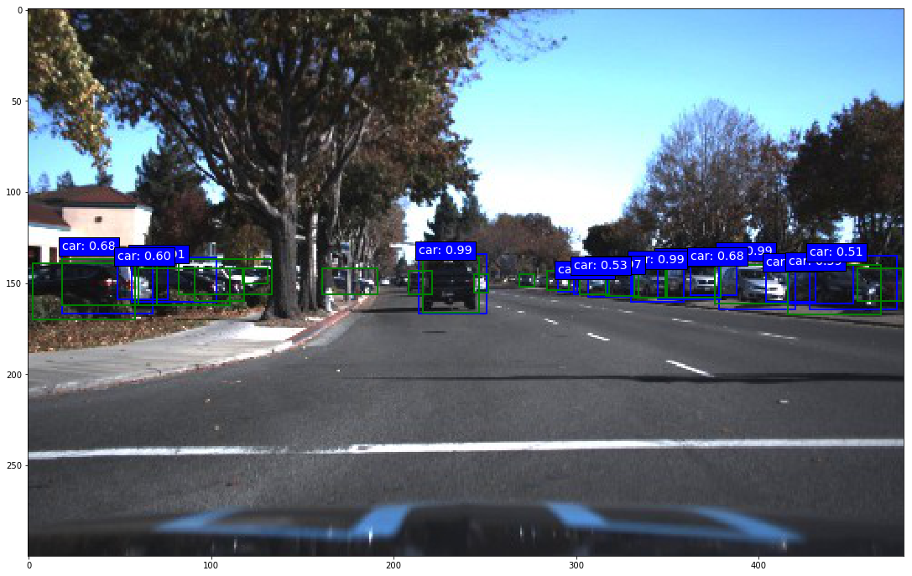
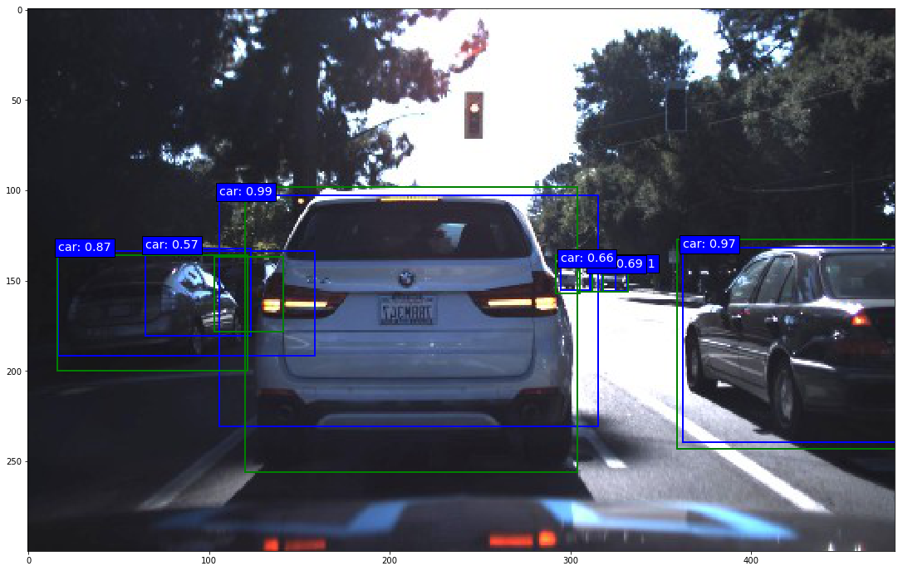

## SSD: Single-Shot MultiBox Detector implementation in Keras
---
### Contents

1. [Overview](#overview)
2. [Examples](#examples)
3. [Dependencies](#dependencies)
4. [How to use it](#how-to-use-it)
5. [ToDo](#todo)
6. [Terminology](#terminology)

### Overview

This is a Keras implementation of the SSD model architecture introduced by Wei Liu at al. in the paper [SSD: Single Shot MultiBox Detector](https://arxiv.org/abs/1512.02325).

The main goal of this project is to create an SSD implementation that is well documented for those who are interested in a low-level understanding of the model. The documentation and detailed comments hopefully make it a bit easier to dig into the code and adapt or build upon the model than with most other implementations out there (Keras or otherwise) that provide little to no documentation and comments. That being said, the goal of this project is not to provide a fully trained model, at least not until I get around to porting the trained weights from the original Caffe implementation. At the moment, you will have to either train the model yourself or port some trained weights from elsewhere.

There are currently two base network architectures in this repository. The first one, [`keras_ssd300.py`](./keras_ssd300.py), is a port of the original SSD300 architecture that is based on a reduced atrous VGG-16 as described in the paper. The network architecture and all default parameter settings were taken directly from the `.prototxt` files of the original Caffe implementation. The other, [`keras_ssd7.py`](./keras_ssd7.py), is a smaller 7-layer version that can be trained from scratch relatively quickly even on a mid-tier GPU, yet is capable enough to do an OK job on Pascal VOC and a surprisingly good job on datasets with only a few object categories. Of course you're not going to get state-of-the-art results with that one.

If you want to build an arbitrary SSD model architecture, you can use [`keras_ssd7.py`](./keras_ssd7.py) as a template. It provides documentation and comments to help you turn it into a deeper network easily.

### Examples

Below are some prediction examples of an SSD7 (i.e. the small 7-layer version) trained on two street traffic datasets released by [Udacity](https://github.com/udacity/self-driving-car/tree/master/annotations) with roughly 20,000 images in total and 5 object categories (more info in [`train_ssd7.ipynb`](./train_ssd7.ipynb)). The predictions you see below were made after only 7000 training steps at batch size 32. Admittedly, cars are comparatively easy objects to detect and the model's performance on detecting pedestrians after this small number of training steps is still bad (which is also owed to there being relatively few pedestrians in the dataset), but it is nonetheless remarkable what such a small model can do after 7000 training iterations. Predictions are shown as blue boxes with labels and ground truth boxes are shown in green for comparison (without labels for better clarity).

| | |
|---|---|
|  |  |
|  |  |

### Dependencies

* Python 3.x
* Numpy
* TensorFlow 1.x
* Keras 2.x
* OpenCV (for data augmentation)
* Beautiful Soup 4.x (to parse XML files)

Both TensorFlow 1.0 and Keras 2.0 introduced major syntax changes, so this code won't work with older versions. The Theano backend is currently not supported.

### How to use it

Clone or download this repository, then:

#### Training and prediction

The general training setup is layed out and explained in [`train_ssd7.ipynb`](./train_ssd7.ipynb) and in [`train_ssd300.ipynb`](./train_ssd300.ipynb). The setup and explanations are similar in both notebooks for the most part, so it doesn't matter which one you look at to understand the general training setup, but the parameters in [`train_ssd300.ipynb`](./train_ssd300.ipynb) are preset to copy the setup of the original Caffe implementation for training on Pascal VOC, while the parameters in [`train_ssd7.ipynb`](./train_ssd7.ipynb) are preset to train on the [Udacity traffic datasets](https://github.com/udacity/self-driving-car/tree/master/annotations). If your goal is not to train the original SSD300, then I would recommend reading [`train_ssd7.ipynb`](./train_ssd7.ipynb), which contains slightly more general explanations.

To train the original SSD300 model on Pascal VOC, download the datasets:

```
wget http://host.robots.ox.ac.uk/pascal/VOC/voc2012/VOCtrainval_11-May-2012.tar
wget http://host.robots.ox.ac.uk/pascal/VOC/voc2007/VOCtrainval_06-Nov-2007.tar
wget http://host.robots.ox.ac.uk/pascal/VOC/voc2007/VOCtest_06-Nov-2007.tar
```

Set the file paths to the data accordingly in [`train_ssd300.ipynb`](./train_ssd300.ipynb) and execute the cells. I would also recommend loading pre-trained weights at least for the reduced VGG-16 base network, although I haven't gotten around to porting weights from the Caffe implementation myself yet. Training and prediction are covered in the notebook, but mAP evaluation is not.

#### Working with the generator

If you'd like to train a model on arbitrary datasets, a brief introduction to the design of the data generator may be useful:

The generator class `BatchGenerator` is in the module [`ssd_batch_generator.py`](./ssd_batch_generator.py) and using it consists of three steps:

1. Create an instance using the constructor. The constructor simply sets the file path to the images, a list of object classes to be included (you may not want to include all object classes that are annotated in the dataset), and the desired order in which the generator yields the ground truth box coordinates and class ID. Even though different box coordinate orders are theoretically possible, `SSDBoxEncoder` currently requires the generator to pass ground truth box coordinates to it in the format `[class_id, xmin, xmax, ymin, ymax]`, which is also the constructor's default setting for this parameter.
2. Next, lists of image names and annotations (labels, targets, call them whatever you like) need to be parsed from one or multiple source files such as CSV or XML files by calling one of the parser methods that `BatchGenerator` provides. The generator object stores the data that is later used to generate the batches in two Python lists: `filenames` and `labels`. The former contains just the names of the images to be included, e.g. "001934375.jpg". The latter contains for each image a Numpy array with the bounding box coordinates and object class ID of each labeled object in the image. The job of the parse methods that the generator provides is to create these two lists. `parse_xml()` does this for the Pascal VOC data format and `parse_csv()` does it for any CSV file in which the image names, category IDs and box coordinates make up the first six columns of the file. If you have a dataset that stores its annotations in a format that is not compatible with the two existing parser methods, you can just write an additional parser method that can parse whatever format your annotations are in. As long as that parser method sets the two lists `filenames` and `labels` as described in the documentation, you can use this generator with any arbitrary dataset without having to change anything else.
3. Finally, in order to actually generate a batch, call the `generate()` method. You have to set the desired batch size and whether or not to generate batches in training mode. If batches are generated in training mode, `generate()` calls the `encode_y()` method of `SSDBoxEncoder` from the module [`ssd_box_encode_decode_utils.py`](./ssd_box_encode_decode_utils.py) to convert the ground truth labels into the big tensor that the cost function needs. This is why you need to pass an `SSDBoxEncoder` instance to `generate()` in training mode. Inside `encode_y()` is where the anchor box matching and box coordinate conversion happens. If batches are not generated in training mode, then the ground truth labels are just returned in their regular format along with the images. The remaining arguments of `generate()` are mainly image manipulation features for online data augmentation and to get the images into the size you need. The documentation describes them in detail.

#### Encoding and decoding boxes

The module [`ssd_box_encode_decode_utils.py`](./ssd_box_encode_decode_utils.py) contains all functions and classes related to encoding and decoding boxes. Encoding boxes means converting ground truth labels into the target format that the loss function needs during training. It is this encoding process in which the matching of ground truth boxes to anchor boxes (the paper calls them default boxes and in the original C++ code they are called priors - all the same thing) happens. Decoding boxes means converting raw model output back to the input label format, which entails various conversion and filtering processes such as non-maximum suppression (NMS).

In order to train the model, you need to create an instance of `SSDBoxEncoder` that needs to be passed to the batch generator. The batch generator does the rest, so you don't usually need to call any of `SSDBoxEncoder`'s methods manually. If you choose to use your own generator, here is very briefly how the `SSDBoxEncoder` class is set up: In order to produce a tensor for training you only need to call `encode_y()`, which calls `generate_encode_template()` to make a template full of anchor boxes, which in turn calls `generate_anchor_boxes()` to compute the anchor box coordinates for each predictor layer. The matching happens in `encode_y()`.

To decode the raw model output, call either `decode_y()` or `decode_y2()`. The former follows the procedure outlined in the paper, which entails doing NMS per object category, the latter is a more efficient alternative that does not distinguish object categories for NMS and I found it also delivers better results. Read the documentation for details about both functions.

A note on the `SSDBoxEncoder` constructor: The `coords` argument lets you choose what coordinate format the model should learn. If you choose the 'centroids' format, the targets will be converted to the `(cx, cy, w, h)` coordinate format used in the original implementation. If you choose the 'minmax' format, the targets will be converted to the coordinate format `(xmin, xmax, ymin, ymax)`.

A note on the relative box coordinates used internally by the model: This may or may not be obvious to you, but it is important to understand that it is not possible for the model to predict absolute coordinates for the predicted bounding boxes. In order to be able to predict absolute box coordinates, the convolutional layers responsible for localization would need to produce different output values for the same object instance at different locations within the input image. This is not possible, since for a given input to the filter of a convolutional layer, the filter will produce the same output regardless of the spatial position within the image because of the shared weights. This is the reason why the model predicts offsets to anchor boxes instead of absolute coordinates, and why during training, absolute ground truth coordinates are converted to anchor box offsets in the encoding process. The fact that the model predicts offsets to anchor box coordinates is in turn the reason why the model contains anchor box layers that do nothing but output the anchor box coordinates so that the model's output tensor can include those. If the model's output tensor did not contain the anchor box coordinates, the information to convert the predicted offsets back to absolute coordinates would be missing in the model output.

#### Using a different base network architecture

If you want to build a different base network architecture, you could use [`keras_ssd7.py`](./keras_ssd7.py) as a template. It provides documentation and comments to help you turn it into a deeper network easily. Put together the base network you want and add a predictor layer on top of each network layer from which you would like to make predictions. Create two predictor heads for each, one for localization, one for classification. Create an anchor box layer for each predictor layer and set the respective localization head's output as the input for the anchor box layer. All tensor reshaping and concatenation operations remain the same, you just have to make sure to include all of your predictor and anchor box layers of course.

### ToDo

The following things are still on the to-do list and contributions are welcome:

* Port weights from the original Caffe implementation, both for the reduced VGG-16 base network and for the fully trained networks in all configurations (SSD300, SSD512, trained on Pascal VOC, MS COCO etc.)
* Write an mAP evaluation module
* Support the Theano backend

### Terminology

* "Anchor boxes": The paper calls them "default boxes", in the original C++ code they are called "prior boxes" or "priors", and the Faster R-CNN paper calls them "anchor boxes". All terms mean the same thing, but I slightly prefer the name "anchor boxes" because I find it to be the most descriptive of these names. I call them "prior boxes" or "priors" in `keras_ssd300.py` to stay consistent with the original Caffe implementation, but everywhere else I use the name "anchor boxes" or "anchors".
* "Labels": For the purpose of this project, datasets consist of "images" and "labels". Everything that belongs to the annotations of a given image is the "labels" of that image: Not just object category labels, but also bounding box coordinates. I also use the terms "labels" and "targets" more or less interchangeably throughout the documentation, although "targets" means labels specifically in the context of training.
* "Predictor layer": The "predictor layers" or "predictors" are all the last convolution layers of the network, i.e. all convolution layers that do not feed into any subsequent convolution layers.
