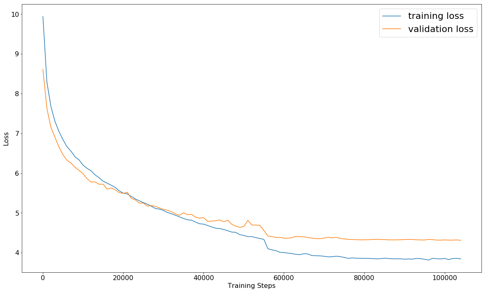

## SSD300 Pascal VOC 07+12 Training Summary
---

This is a summary of the training of an SSD300 on the Pascal VOC 2007 `trainval` and 2012 `trainval` image sets using the same configuration as in the original Caffe implementation for that same model.

Since neither the SSD paper nor the GitHub repository of the original Caffe SSD implementation state details on the training progress, but only the final evaluation results, maybe some will find the loss curves and intermediate mAP evaluation results provided here helpful for comparison with their own training.

What you see below are the training results of running the [`ssd300_training.ipynb`](../ssd300_training.ipynb) notebook as is, in which all parameters are already preset to replicate the training configuration of the original SSD300 "07+12" model. I just made one small change: I occasionally ran into `OOM` errors at batch size 32, so I trained with batch size 31.

Important note about the data shown below:

SGD is inherently unstable at the beginning of the training. Remember that the optimization is stochastic, i.e. if you start a fresh training ten times, the loss pattern over the first training steps can look different each time, and in the case of SGD, very different. One time the loss might decrease smoothly right from the start, which is what happened in my case below. Another time the loss might get temporarily stuck on a plateau very early on such that nothing seems to be happening for a couple of hundred training steps. Yet another time the loss might blow up right at the start and become `NaN`. As long as the loss doesn't become `NaN`, the final convergence loss does, in my experience, not strongly depend on the loss progression in the very early phase of the training. In other words, even if the loss doesn't decrease as fast in the beginning, you will likely still end up with the same convergence loss, it will just take longer to get there. Just as a benchmark, after the first 1,000 training steps I've seen anything between around 10 and 15 as values for the training loss. The Adam optimizer doesn't suffer from this variability to the same extent and is evidently the superior optimizer, but since the original Caffe models were trained with SGD, I used that to reproduce the original results.

### Training and Validation Loss

What you see below are the training and validation loss every 1,000 training steps. The validation loss is computed on the Pascal VOC 2007 `test` image set. In my case it took only around 105,000 instead of the expected 120,000 iterations for the validation loss to converge, but as explained above, it may well take longer. The drop you're seeing at 56,000 training steps was when I reduced the learning rate from 0.001 to 0.0001. The original learning rate schedule schedules this reduction only after 80,000 training steps, but since the loss decreased so quickly in the beginning in my case, I had to decrease the learning rate earlier. I reduced the learning rate to 0.00001 after 76,000 training steps and kept it constant from there.

### Mean Average Precision

Here are the intermediate and final mAP values on Pascal VOC 2007 `test`, evaluated using the official Pascal VOCdevkit 2007 Matlab evaluation code. The table shows the best values after every 20,000 training steps. Once again, the progress may be slower depending on how the early phase of the training is going. In another training I started with the same configuration, I got an mAP of only 0.665 after the first 20,000 training steps. The full model after 102,000 training steps can be downloaded [here](https://drive.google.com/open?id=1-MYYaZbIHNPtI2zzklgVBAjssbP06BeA).

|             | Steps |  20k     |  40k     |  60k     |  80k     |  100k    |  102k    |
|-------------|-------|----------|----------|----------|----------|----------|----------|
|aeroplane    |  AP   |  0.6874  |  0.7401  |  0.7679  |  0.7827  |  0.7912  |  0.7904  |
|bicycle      |  AP   |  0.7786  |  0.8203  |  0.795   |  0.8436  |  0.8453  |  0.8466  |
|bird         |  AP   |  0.6855  |  0.6939  |  0.7191  |  0.7564  |  0.7655  |  0.7672  |
|boat         |  AP   |  0.5804  |  0.6173  |  0.6258  |  0.6866  |  0.6896  |  0.6952  |
|bottle       |  AP   |  0.3449  |  0.4288  |  0.453   |  0.4681  |  0.4896  |  0.4844  |
|bus          |  AP   |  0.7771  |  0.8332  |  0.8343  |  0.8525  |  0.8537  |  0.8554  |
|car          |  AP   |  0.8048  |  0.8435  |  0.8345  |  0.848   |  0.8546  |  0.8543  |
|cat          |  AP   |  0.852   |  0.7989  |  0.8551  |  0.8759  |  0.8727  |  0.8746  |
|chair        |  AP   |  0.5085  |  0.5548  |  0.5287  |  0.5873  |  0.5895  |  0.5911  |
|cow          |  AP   |  0.7359  |  0.7821  |  0.791   |  0.8278  |  0.8271  |  0.8243  |
|diningtable  |  AP   |  0.6805  |  0.7181  |  0.7502  |  0.7543  |  0.7733  |  0.7614  |
|dog          |  AP   |  0.8118  |  0.7898  |  0.8222  |  0.8546  |  0.8544  |  0.8552  |
|horse        |  AP   |  0.823   |  0.8501  |  0.8532  |  0.8586  |  0.8688  |  0.867   |
|motorbike    |  AP   |  0.7725  |  0.7935  |  0.8081  |  0.845   |  0.8471  |  0.8509  |
|person       |  AP   |  0.73    |  0.7514  |  0.7634  |  0.7851  |  0.7869  |  0.7862  |
|pottedplant  |  AP   |  0.4112  |  0.4335  |  0.4982  |  0.5051  |  0.5131  |  0.5182  |
|sheep        |  AP   |  0.6821  |  0.7324  |  0.7283  |  0.7717  |  0.7783  |  0.7799  |
|sofa         |  AP   |  0.7417  |  0.7824  |  0.7663  |  0.7928  |  0.7911  |  0.794   |
|train        |  AP   |  0.7942  |  0.8169  |  0.8326  |  0.867   |  0.862   |  0.8596  |
|tvmonitor    |  AP   |  0.725   |  0.7301  |  0.7259  |  0.7589  |  0.7649  |  0.7651  |
|             |**mAP**|**0.696** |**0.726** |**0.738** |**0.766** |**0.7709**|**0.7711**|
